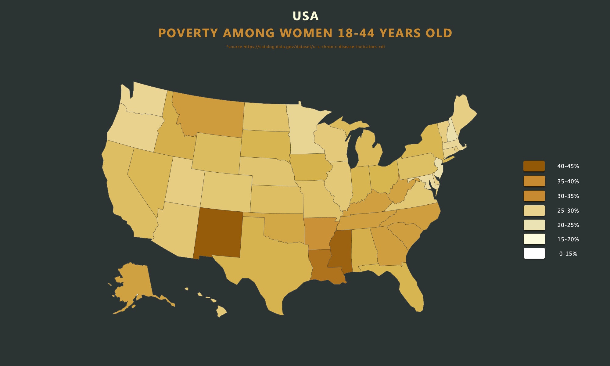
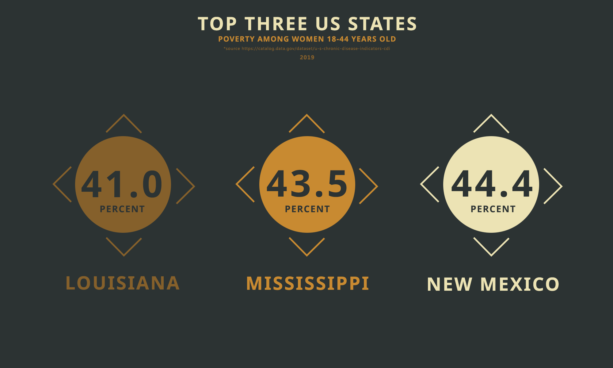

<strong>ABOUT</strong> 
 
In the United States, education has long been hailed as a gateway to economic opportunity and social mobility. However, despite significant strides in women's educational attainment, the prevalence of poverty among women aged 18-44 remains a persistent issue. With 29 million women holding college degrees in 2019, one would expect a commensurate decline in poverty rates among this group. Despite educational achievements, 28.3% of women aged 18-44 in the United States were living in poverty that year. 
 
States such as New Mexico, Mississippi, and Louisiana stand out as particularly concerning, with more than 40% of women aged 18-44 living in poverty. Additionally, 18 states reported poverty levels among women at 30% or higher. 
 

You can find this data sheet at https://catalog.data.gov/dataset/u-s-chronic-disease-indicators-cdi

<strong>WHAT HAVE I COVERED?</strong> 
 
1. USA 'heat' map showing poverty among women 18-44
2. Top three states with poverty among women 18-44

<strong>SCREENSHOTS</strong>

